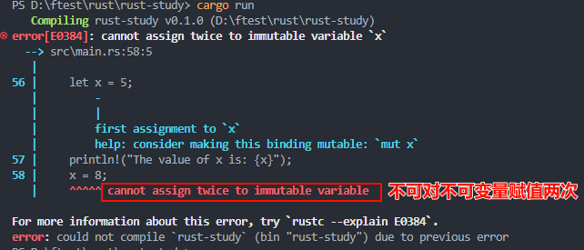
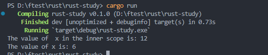
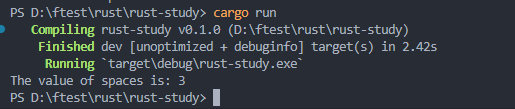
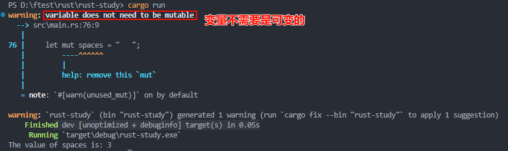
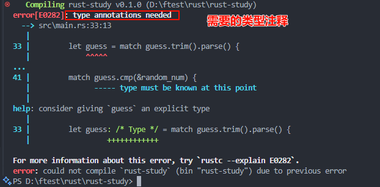
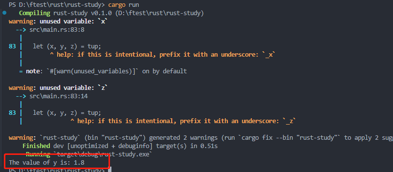
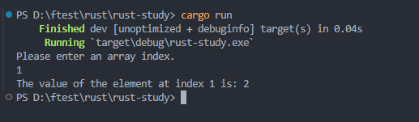
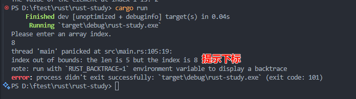

## 变量和可变性

Rust 定义的变量默认是不可改变的（immutable），当变量不可变时，一旦值被绑定一个名称上，你就不能改变这个值。

> 文件名：_src/main.rs_

```rust
fn main() {
    let x = 5;
    println!("The value of x is: {x}");
    x = 8;
    println!("The value of x is: {x}");
}
```

保存并使用 `cargo run ` 运行程序。会查看到可以再次赋值信息，如下图：



若需要能够改变定义的变量名前加 `mut` 使其可变

> 修改 _src/main.rs_

```rust
fn main() {
    let mut x = 5;
    println!("The value of x is: {x}");
    x = 8;
    println!("The value of x is: {x}");
}
```

运行程序，如下图：


## 常量

常量 (constants) 是绑定到一个名称的不允许改变的值，不过常量与变量还是有一些区别。

- 不允许对常量使用 `mut`
- 必须标注类型
- 可以在任何作用域声明，包括全局作用域
- 只能被设置为常量表达式，而不可以是其他任何只能在运行时计算出的值

> Rust 对常量命名约定单词之间使用 **全大写** 加 **下划线**  
> 有关声明常量时可以使用哪些操作的详细信息，请参阅 [Rust Reference 的常量求值部分](https://doc.rust-lang.org/reference/const_eval.html 'const_eval')

例如：

```rust
const THREE_HOURS_IN_SECONDS: u32 = 60 * 60 * 3;
```

## 隐藏

可以定义一个与之前变量同名的新变量。被称之为第一个变量被第二个 隐藏（Shadowing） 了，这意味着当您使用变量的名称时，编译器将看到第二个变量。实际上，第二个变量“遮蔽”了第一个变量，_此时任何使用该变量名的行为中都会视为是在使用第二个变量，直到第二个变量自己也被隐藏或第二个变量的作用域结束_。可以用相同变量名称来隐藏一个变量，以及重复使用 let 关键字来多次隐藏，如下所示：

```rust
fn main () {
    let x = 5;
    let x = x + 1;
    {
        let x = x * 2;
        // 此时访问的作用域内的 x
        println!("The value of  x in the inner scope is: {x}")
    }
    // 访问的是 第二次 重新赋值的变量 x
    println!("The value of x is: {x}");
}
```

运行结果：



> mut 和 影藏的区别

当再次使用 let 时，实际上创建了一个新变量，我们可以改变值的类型，如下所示：

```rust
fn main () {
    let spaces = "   ";
    let spaces = spaces.len();
    println!("The value of spaces is: {spaces}")
}
```

运行结果：



如果尝试使用 mut，将会得到一个编译时错误，如下所示：

```rust
fn main () {
    let mut spaces = "   ";
    let spaces = spaces.len();
    println!("The value of spaces is: {spaces}")
}
```

运行结果：

> 正常输出结果，会产生警告。这个错误说明，我们不能改变变量的类型



## 数据类型

在 Rust 中，每个值都有对应的 **数据类型**（_data type_），被指定为何种数据，以便明确数据处理方式。具体两类数据类型子集：**标量**（_scalar_）和 **复合**（_compound_）。

> 注意：Rust 是静态类型（_statically typed_）语言，也就是编译时就必须知道所有变量的类型。根据值及其使用方式，编译器通常可推断出我们想要的类型。当多种类型均有可能，必须增加 **注解**，例如 **猜数字 DEMO**：使用 `parse` 将 `String` 转换为数字

```rust
let guess = "30".parse().expect("Not a number!");
```

若不进行注解，运行会报错。



### 标量类型

标量（scalar）类型代表一个单独的值。Rust 四种基本的标量类型：**整型**、**浮点型**、**布尔类型**、**字符类型**。

#### 整型

**整数** 是一个没有小数部分的数字。

> **有符号** 和 **无符号** 代表数字 **能否为负值** === 数字是否有可能是**负数**（**有符号数**），或者永远为**正**而不需要符号（**无符号数**）

| 长度    | 有符号 | 无符号 |
| ------- | ------ | ------ |
| 8-bit   | i8     | u8     |
| 16-bit  | i16    | u16    |
| 32-bit  | i32    | u32    |
| 64-bit  | i64    | u64    |
| 128-bit | i128   | u128   |
| arch    | isize  | usize  |

任何一种形式编写数字字面值。

> 注意可以是多种数字类型的数字字面值允许使用类型后缀，例如 57u8 来指定类型，同时也允许使用 \_ 做为分隔符以方便读数，例如 1_000，它的值与你指定的 1000 相同。

| 数字字面值                  | 例子        |
| --------------------------- | ----------- |
| Decimal(十进制)             | 98_222      |
| Hex(十六进行)               | 0xff        |
| Octal(八进制)               | 0o77        |
| Binary(二进制)              | 0b1111_0000 |
| Byte(单字节字符)[仅限于 u8] | b'A'        |

> Rust 的默认类型是i32。 isize 和 usize 主要作为某些集合的索引

> **整型溢出**  
> 比方说类型是 `u8` ,它可以存放 `0-255` 的值。若值是 `256` 则会产生 **整型溢出**（_Integer overflow_），会导致以下两种行为之一的发生。  
> 1. 当 debug 模式编译下时，Rust 检查这类问题并程序 _panic_。
> 2. 使用 `--release` flag在 release 模式中构建，Rust 不会检查会导致 _panic_ 的整型溢出，而是会进行一种**二进制补码**（_tow's complement wrapping_）的操作。简而言之，比此类型能容纳最大值还大的值会回绕到最小值值， `256` 变成 `0`，值 `257` 变成 `1`，依此类推。程序不会 _panic_，不过变量可能也不会是你所期望的值。依赖整型溢出 wrapping 的行为被认为是一种错误。    


> **为了显式地处理溢出的可能性，可以使用这几类标准库提供的原始数字类型方法：**
>  - 所有模式下都可以使用 wrapping_* 方法进行 wrapping，如 wrapping_add
>  - 如果 checked_* 方法出现溢出，则返回 None值
>  - 用 overflowing_* 方法返回值和一个布尔值，表示是否出现溢出
>  - 用 saturating_* 方法在值的最小值或最大值处进行饱和处理

#### 浮点型

Rust 也有两个原生的 **浮点数**（_floating-point numbers_）类型，它们是带小数点的数字。Rust 的浮点数类型是 `f32` 和 `f64`，分别占 `32` 位和 `64` 位。默认类型是 `f64`，所有的浮点型都是有符号的。

> 浮点数采用 IEEE-754 标准表示。`f32` 是单精度浮点数，`f64` 是双精度浮点数。

示例：

```rust
fn main () {
    let floats = 2.0 // f64
    let float: f32 = 3.0 // f32 
}
```

> **数值运算**
> Rust 中的所有数字类型都支持基本数学运算：加法、减法、乘法、除法和取余。**整数除法**会向**零舍入到最接近的整数**。下面的代码展示了如何在 let 语句中使用它们：

```rust
fn main () {
    // 加法
    let sum = 5 + 10;
    // 减法
    let subtraction = 10.2 - 2.7;
    // 乘法
    let multiplication = 4 * 20;
    // 除法
    let quotient = 56.7 / 32.2;
    let truncated = -5 / 3; // 结果为 -1
    // 取余
    let surplus = 11 % 2; // 结果为 1
}
```

#### 布尔类型

Rust 中的布尔类型有两个值：`true` | `false`。Rust 中的布尔类型使用 `bool` 表示。例如：

```rust
fn main () {
    let t = true;
    let f: bool = false; // 使用显式类型注释
}
```

#### 字符类型

Rust 的 `char` 类型是语言中最原生的字母类型。下面是一些声明 `char` 值的例子：

```rust
fn main () {
    let c = 'z';
    let z: char = 'xxx'; // 使用显式类型注释
    let emote = '😻';
}
```

> 注意：`单引号` 声明 char `字面量`， 使用 `双引号` 声明 `字符串字面量`。

### 复合类型

**复合类型**（_Compound types_）可以将多个值组合成一个类型。Rust 有两个原生的复合类型：**元组**（_tuple_）和**数组**（_array_）。

#### 元组类型

元组是将 `多个不同类型的值` 组合进行一个复合类型的主要方式。

> 元组的长度固定：一旦声明，其长度不会增大或缩小
> 元组结构： let 变量名: (显示注解, 显示注解, ...) = (对应显示注解类型的值, 对应显示注解类型的值, ...);

示例：

```rust
fn main () {
    let tup: (u32, f64, u8) = (400, 1.8, 10);
}
```
获取示例的单个值的方式，可以使用模式匹配（pattern matching）来解构（destructure）元组值，例如：

```rust
fn main () {
    let tup: (u32, f64, u8) = (400, 1.8, 10);
    let (x, y, z) = tmp;
    println!("The value of y is: {y}");
}
```



我们也可以使用点号 **（.）** 后跟值的索引来直接访问它们。例如：

> 元组的第一个索引值是 0

```rust
fn main () {
    let tup: (u32, f64, u8) = (400, 1.8, 10);
    let five_hundred = tup.0; // 访问的是 400
    let six_point_four = tup.1; // 访问的是 1.8
    let one = tup.2; // 访问的是 10
}
```

> 不带任何值的元组有个特殊的名称，叫做 `单元`（_unit_） 元组。这种值以及对应的类型都写作 **()**，表示空值或空的返回类型。如果表达式不返回任何其他值，则会隐式返回单元值。

#### 数组类型

另一个包含多个值的方式是 **数组**（_array_）。与元组不同，数组中的 `每个元素的类型必须相同`。Rust 中的数组与一些其他语言中的数组不同，Rust 中的 `数组长度是固定的`。

> vector 类型是标准库提供的一个 允许 增长和缩小长度的类似数组的集合类型, 

示例：

```rust
fn main () {
    let a = [1, 2, 3, 4, 5];

    let first = a[0];
    let second = a[1];
}
```
**无效数组元素访问**

示例：
```rust

use std::io;

fn main () {
    let a = [1, 2, 3, 4, 5];
    println!("Please enter an array index.");
    let mut index = String::new();
    io::stdin()
        .read_line(&mut index)
        .expect("Failed to read line.");

    let index: usize = index
        .trim()
        .parse()
        .expect("index entered was not number.");
    let element = a[index];
    println!("The value of the element at index {index} is: {element}");
}
```
执行上述代码两种情况：

- 正常输入index(0~4):  


- 异常输入index: 




## 函数

Rust 代码中的函数和变量名使用 `snake case` 规范风格。在 snake case 中，所有字母都是小写并使用下划线分隔单词。这是一个包含函数定义示例的程序：

```rust
fn main () {
  println!("Hello World!");
  another_function();
}
// 函数命名规范
fn another_function () {
  println!("another_function");
}
```

#### 参数

定义为拥有 **参数**（_parameters_）的函数。如下所示：

>在函数签名中，**必须** 声明每个参数的类型

```rust
fn main () {
    println!("Hello World!");
    another_params(10);
}

fn another_params (x: u32) {
    println!("The value of x is: {x}");
}
```

#### 语句和表达式
函数体由一系列的语句和一个可选的结尾表达式构成。**语句**（_Statements_）是执行一些操作但不返回值的指令。 **表达式**（_Expressions_）计算并产生一个值。

**语句**

> 注：其他语言中可以 `x = y = 6`， _Rust_ 中不能这样写。 

```rust
fn main() {
    let y = 6;
}
```

**表达式**
> 注：`x+1` 这一行在**结尾没有分号**，与你见过的大部分代码行不同。**表达式的结尾没有分号**。如果在表达式的结尾加上分号，它就变成了语句，而语句不会返回值。在接下来探索具有返回值的函数和表达式时要谨记这一点。

```rust
fn main () {
    let y = {
        let x = 6;
        x + 1
    };
    println!("The value of y is: {y}");
}
// 上述案例，表达式
// {
//     let x = 6;
//     x + 1
// }
// 是一个代码块，它的值是 4。
```

#### 具有返回值的函数

函数可以向调用它的代码返回值。我们并不对返回值命名，但要在**箭头（->）后声明它的类型**。在 Rust 中，函数的返回值等同于函数体最后一个表达式的值。使用 return 关键字和指定值，可从函数中提前返回；但**大部分函数隐式的返回最后的表达式**。

示例1：
```rust
fn five() -> i32 {
    5
}

fn main () {
    let x = five();
    println!("The value of x is: {x}");
}
```
在 five 函数中没有函数调用、宏、甚至没有 let 语句 —— 只有数字 5。在**Rust 中是一个完全有效的函数**。注意，也指定了函数返回值的类型，就是 -> i32。

示例2：
```rust
fn plus_one(x: i32) -> i32 {
    // x + 1
    x + 1;
}

fn main () {
    let x = plus_one(10);
    println!("The value of x is: {x}");
}
```

运行代码会打印出 `The value of x is: 6`。但如果在包含 x + 1 的行尾加上一个`分号`，把它从表达式变成语句，我们将看到一个错误。


## 注释

```rust
# 这是一个简单的注释：

// hello, world

# 注释也可以放在包含代码的行的末尾：

fn main() {
    // I’m feeling lucky today
    let lucky_number = 7; // I’m feeling lucky today
}
```
> Rust 还有另一种注释，称为**文档注释**，后续记录。

## 控制流

根据条件是否为真来决定是否执行某些代码，以及根据条件是否为真来重复运行一段代码的能力是大部分编程语言的基本组成部分。Rust 代码中最常见的用来控制执行流的结构是 `if` 表达式和循环。

#### if 表达式

if 表达式允许根据条件执行不同的代码分支。你提供一个条件并表示 “如果条件满足，运行这段代码；如果条件不满足，不运行这段代码。”

示例1：
> 代码中的条件 **必须** 是 **bool** 值。 Rust 并不会尝试自动地将非布尔值转换为布尔值。
```rust
fn main () {
    let number = 5;
    if number < 6 {
        // 小于 6 执行
        println!("condition war true");
    } else {
        // 大于等于 6 执行
        println!("condition war false");
    }
}
```

#### 使用 else if 处理多重条件

```rust
fn main() {
    let number = 6;

    if number % 4 == 0 {
        println!("number is divisible by 4");
    } else if number % 3 == 0 {
        println!("number is divisible by 3");
    } else if number % 2 == 0 {
        println!("number is divisible by 2");
    } else {
        println!("number is not divisible by 4, 3, or 2");
    }
}
```

运行后应该能看到如下输出：  


当执行这个程序时，它按顺序检查每个 `if` 表达式并执行第一个条件为 `true` 的代码块。注意即使 `6` 可以被 `2` 整除，也不会输出 `number is divisible by 2`，更不会输出 `else` 块中的 `number is not divisible by 4, 3, or 2`。原因是 `Rust 只会执行第一个条件为 true 的代码块`，并且一旦它找到一个以后，甚至都不会检查剩下的条件了。

使用过多的 else if 表达式会使代码显得杂乱无章，所以如果有多于一个 else if 表达式，最好重构代码。为此，后续会介绍一个强大的 **Rust 分支结构**（_branching construct_），叫做 **match**。

#### 在 let 语句中使用 if

```rust
fn main () {
    let condition = true;
    let number = if condition { 5 } else { 6 };
    println!("The value of number is: {number}"); // 输出 5
}
```

#### 使用循环重复执行
多次执行同一段代码是很常用的，Rust 为此提供了多种 **循环**（_loops_）。

> Rust 有三种循环：_**loop**_、_**while**_ 、 _**for**_

**使用 loop 重复执行代码**
`loop` 关键字告诉 Rust 一遍又一遍地执行一段代码直到你明确要求停止。
> 停止：使用 `break` 关键字进行结束循环

```rust
fn main () {
    loop {
        println!("execute loop!");
        // break; // 若加上 则执行一次，反之 一直打印 execute loop! 可使用 ctrl + c 进行结束
    }
}
```

**从循环返回值**

```rust
fn main() {
    let mut counter = 0;
    let result = loop {
        counter += 1;
        if counter == 10 {
            break counter * 2;
        }
    };
    println!("The result is {result}"); // The result is 20
}
```

**循环标签：在多个循环之间消除歧义**

如果存在嵌套循环，break 和 continue 应用于此时最内层的循环。你可以选择在一个循环上指定一个 **循环标签**（_loop label_）。

```rust
fn main () {
  let mut count = 0;
  'counting_up: loop {
      println!("count = {count}");
      let mut remaining = 10;
      loop {
          println!("remaining = {remaining}");
          if remaining == 9 {
            // 终止内层循环
            break;
          }
          if count == 2 {
            // 终止外层循环
            break 'counting_up;
          }
          remaining -= 1;
      }
      count += 1;
  }
  println!("END count = {count}");
}
```

#### while 条件循环

```rust
fn main () {
    let mut number = 3;
    // 条件为 true 输出 number \ 反之 LIFTOFF!
    while number != 0 {
        println!("{number}!");
         number -= 1;
    }
    println!("LIFTOFF!");
}
```

#### 使用 for 遍历集合

```rust
// while 写法
fn main () {
  let list = [10, 20, 30, 40, 50];
  let mut index = 0;
  while index < list.len() {
      println!("The value of list[{index}] is: {}", list[index]);
      index += 1;
  }
}

// for 写法
fn main () {
    let list = [10, 20, 30, 40, 50];
    for item in list {
        println("the value of item is : {item}")
    }
}

// 倒计时例子
fn main() {
    // rev，用来反转
    for number in (1..4).rev() {
        println!("{number}!");
    }
    println!("LIFTOFF!!!");
}
```